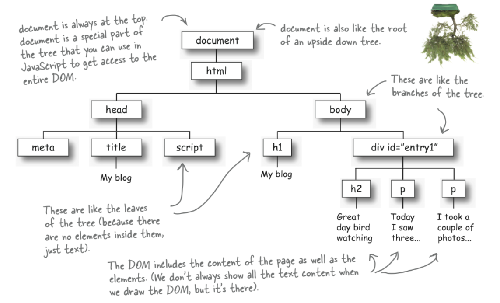

# JavaScript


<strong>O que é JavaScript?</strong>
Uma linguagem de programação (LP) para Web. LP é um conjunto de símbolos, sintática, regras semânticas e palavras-chaves que permite criar códigos com instruções para controlar as ações de uma máquina. 
Javascript é uma linguagem de programação de:

*Alto nível: é aquela cuja sintaxe é voltada para o entendimento humano. É muito mais intuitivo e mais fácil de aprender.

*dinâmica:é uma LP na qual determinadas operações podem ser feitas em tempo de execução em vez de em tempo de compilação. É possível mudar o tipo de uma variável ou adicionar novas propriedades ou métodos a um objeto enquanto o programa está sendo executado.

*interpretada:Em uma linguagem interpretada, o código fonte não é traduzido diretamente pela máquina de destino. Em vez disso, um programa diferente, o interpretador, lê e executa o código.

*não tipada: As linguagens de programação não tipadas são linguagens onde podemos declarar variáveis sem definir o seu tipo.


<strong>Formas de mostrar dados para o usuário:</strong>

*manipulando elemento do HTML, colocando um id na tag que vc quer manipular. 
Exemplo: código html: ```<h1 id="texto">Seja bem vindo</h1>
         código JS:  getElementById("texto").innerHTML = "Muda-se a msg"```
Éssa função vai selecionar o elemento que tem o id texto e trocar o texto por outro.

```*``` documento.write("a msg que quer colocar")<br/>
```*``` alert("mensagem") => altera alguma coisa na janela<br/>
```*``` outra forma de exibir informações para o usuário(desenvolvedor) é através do console 

<strong>Variáveis:</strong><br/>
 Os tipos de valores que podem ser representados e manipulados em uma linguagem de programação são conhecidos como tipos e uma das características mais fundamentais de uma linguagem de programação é o conjunto de tipos que ela aceita.<br/>
 Quando um programa precisa manter um valor para uso futuro, ele atribui o valor (ou “armazena” o valor) a uma variável. Uma variável  define um nome simbólico para um valor e permite que o valor seja referido pelo nome.<br/>
 Os tipos de JavaScript podem ser divididos em duas categorias: <strong>tipos primitivos e tipos de objeto</strong>. Os tipos primitivos de JavaScript incluem números, sequências de texto (conhecidas como strings) e valores de verdade (conhecidos como booleanos). <br/>
 Os valores especiais null e undefined de JavaScript são valores primitivos, mas não são números, nem strings e nem booleanos. Qualquer valor em JavaScript que não seja número, string, booleano, null ou undefined é um objeto.<br/>
 Um objeto (isto é, um membro do tipo objeto) é um conjunto de propriedades, em que cada propriedade tem um nome e um valor (ou um valor primitivo, como um número ou string, ou um objeto). Um objeto normal em JavaScript é um conjunto não ordenado de valores nomeados. A linguagem também define um tipo especial de objeto, conhecido como array, que representa um conjunto ordenado de valores numerados.<br/>
 JavaScript define outro tipo especial de objeto, conhecido como função. Uma função é um objeto que tem código executável associado. Uma função pode ser chamada para executar esse código executável e retornar um valor calculado. Assim como os arrays, as funções se comportam de maneira diferente dos outros tipos de objetos, sendo que JavaScript define uma sintaxe especial para trabalhar com elas.<br/>
 Um objeto normal em JavaScript é um conjunto não ordenado de valores nomeados. A linguagem também define um tipo especial de objeto, conhecido como array, que representa um conjunto ordenado de valores numerados.<br/><br/>

<strong>Manipulando o DOM</strong>


<legend>Fonte: <a href="https://cursos.alura.com.br/forum/topico-dom-97155">https://cursos.alura.com.br/forum/topico-dom-97155</a></legend>

<br>
<strong>DOM</strong>(Document Object Model)

```*``` É o HTML convertido para um Objeto JavaScript
```*``` API que representa e interage com o HTML
```*``` Estrutura de dados do tipo árvore, criada pelo browser
```*``` Propriedades e métodos
	
É uma interface de programação para documentos HTML, XML e SVG . Ele fornece uma representação estruturada do documento como uma árvore. O DOM define métodos que permitem acesso à árvore, para que eles possam alterar a estrutura, estilo e conteúdo do documento.

O DOM fornece uma representação do documento como um grupo estruturado de nós e objetos, possuindo várias propriedades e métodos. Os nós também podem ter manipuladores de eventos que lhe são inerentes, e uma vez que um evento é acionado, os manipuladores de eventos são executados. Essencialmente, ele conecta páginas web a scripts ou linguagens de programação.

O Document Object Model (DOM) é uma interface de programação para documentos da web. Ele representa a página para que os programas possam alterar a estrutura, o estilo e o conteúdo do documento. O DOM representa o documento como nós e objetos; dessa forma, as linguagens de programação podem interagir com a página.


Como seleccionar elementos na página: <br>
```*``` getElementById()<br>
```*``` getElementsByClassName()<br>
```*``` getElementsByTagName()<br>
```*``` querySelector()<br>
```*``` querySelectorAll()<br>

	
Manipulando Conteúdos<br>
```*``` textContent<br>
```*``` innerText<br>
```*``` innerHTML<br>
```*``` value<br>


